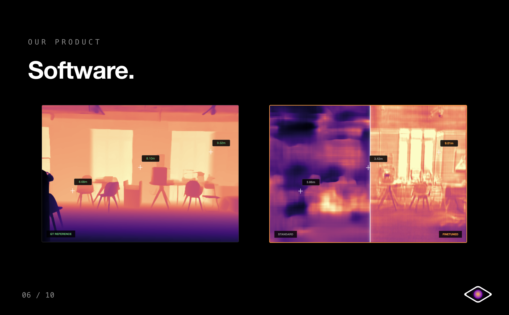

<table>
<tr>
<td width="70%" valign="middle">

# Cyclops Vision — Depth Estimation on Edge Hardware

[EDTH](https://eurodefense.tech/) · [Slides](https://schenker332.github.io/Cyclops-Vision-EDTH/Presentation/)

</td>
<td width="30%" align="right" valign="middle">
	
</td>
</tr>
</table>

Indoor fine-tuning of a ~1.3M-parameter monocular depth model for real-time
inference on a Raspberry Pi 5. Built in 48 hours at the **European Defense
Tech Hackathon Porto (April 2026) — 2nd place**.

---

<p align="center">
	
</p>

<p align="center">
	<i>Cyclops Vision presented live at the <a href="https://eurodefense.tech/">EDTH</a> hackathon.</i>
</p>

## Results

Iterative fine-tuning of [RTMonoDepth_s](https://github.com/Ecalpal/RT-MonoDepth)
(KITTI-pretrained) on 129 indoor iPhone images, with pseudo-GT depth maps
distilled from
[Depth Anything V3 Nested](https://github.com/DepthAnything/Depth-Anything-V3).
Loss: scale-invariant log loss (SILog).

| Version | Trainable params         | Val Loss | δ1     | δ2     | δ3     |
|---------|--------------------------|----------|--------|--------|--------|
| v1      | 15k (head only)          | 4.819    | ~29 %  | ~58 %  | ~78 %  |
| v2      | 287k (head, weighted)    | collapsed| —      | —      | —      |
| v3      | 392k (decoder + head)    | 4.607    | ~34 %  | ~62 %  | ~80 %  |
| **v4**  | **945k (enc + dec + head)** | **4.414** | **34.2 %** | **64.0 %** | **82.0 %** |

For reference, state-of-the-art on NYU Depth v2 reaches δ1 ≈ 90 %, RMSE ≈ 0.35 m.

Full training narrative, ablations and limitations:
[`reports/training_report.md`](reports/training_report.md).

<p align="center">
	
</p>

<p align="center">
	<i>Software demo: predicted depth field, base model vs. finetuned output.</i>
</p>

## Deployment

| Metric                              | Value                |
|-------------------------------------|----------------------|
| Model size (ONNX, FP32)             | ~5 MB                |
| Inference, Raspberry Pi 5 (CPU)     | ~5–10 FPS @ 192×640  |
| Runtime dependencies on the Pi      | `onnxruntime`, `numpy`, `pillow` (no PyTorch) |
| Input                               | RGB image, [0, 1]    |
| Output                              | Metric depth, 0.1–10 m |

`depth_model_pi.onnx` in this repo is the v4 export ready to drop on the Pi.

## What's hard about this problem

A few honest notes — the δ1 of 34 % vs. SOTA's ~90 % isn't an architecture
problem. It's a data problem:

- **129 images, 2–3 rooms.** NYU Depth v2 has 47k images from 464 rooms.
  The model has very little to generalize over, and consecutive frames
  from the same scene are highly correlated.
- **Pseudo-GT, not measurement.** The supervision signal comes from a
  larger transformer (Depth Anything V3 Nested), so the student inherits
  the teacher's errors. Real LiDAR or structured light would give a
  cleaner target.
- **Domain gap.** The KITTI-pretrained encoder learned outdoor dashcam
  scenes (0–80 m). Indoor (0.5–8 m, handheld) is a very different prior;
  unfreezing only the last encoder block helps but doesn't bridge the gap
  with this little data.
- **Edge constraints.** 5 MB model, no GPU, no PyTorch on the Pi. ONNX
  export is the deployment story; the training script is desktop-only.

With 500+ images from 20+ rooms and a fully-unfrozen encoder, δ1 > 60 % is
realistic.


## Setup

```bash
git clone <this repo>
cd cyclops-vision-depth
python -m venv venv && source venv/bin/activate
pip install -r requirements.txt
```

### 1. Pretrained KITTI weights (required for training and PyTorch inference)

Download `encoder.pth` and `depth.pth` from the upstream RT-MonoDepth repo
([Google Drive link](https://drive.google.com/file/d/1Jf5K3m0DfAqVcVCE6y0cKufEKIHu86sz/view?usp=drive_link),
maintained by the original authors) and place them in `./weights/`:

```
weights/
├── encoder.pth
└── depth.pth
```

These are licensed for **non-commercial use only** under the Monodepth2
licence and are not redistributed here.

### 2. Training data (not redistributed)

We trained on 129 iPhone photos taken inside the hackathon venue. Several of
them contain **identifiable people**, so we can't publish the dataset.

To reproduce the training pipeline on your own indoor photos:

1. Capture / collect indoor images, save as `IMG_<id>.jpg` in
   `./ground_truth/image_gt/`.
2. Generate pseudo-GT metric depth maps with
   [Depth Anything V3 Nested](https://github.com/DepthAnything/Depth-Anything-V3)
   (follow the upstream instructions; it's a separate model with its own
   licence). Save each as `depth_IMG_<id>_metric.npy` (float32, units of metres)
   in `./ground_truth/depth/`.
3. Edit the `ALL_IDS` / `VAL_IDS` lists in `finetune_indoor.py` to point at
   your IDs.

### 3. Train

```bash
python finetune_indoor.py --epochs 50
```

Defaults reproduce the v4 setup: encoder `convs[2]` unfrozen at lr=5e-8,
decoder at lr=1e-6, refinement head at lr=1e-3, StepLR (×0.1 every 20 epochs).
Best weights are saved to `./weights_finetuned_v4/`.

### 4. Export to ONNX

```bash
python export_for_pi.py                  # FP32, ~5 MB
python export_for_pi.py --quantize       # INT8, ~2× faster on the Pi
```

### 5. Run on the Pi 5

```bash
# On the Pi (one-time):
pip install -r requirements-pi.txt

# Then:
python3 infer_pi.py --image photo.jpg
python3 infer_pi.py --image photos/      # folder
```

## Limitations

See [`reports/training_report.md`](reports/training_report.md) for the
full version. Short version: 129 images is too few; pseudo-GT is not real
measurement; the KITTI prior helps less indoors than we hoped. We're
publishing the work as an honest 48-hour engineering snapshot, not a
finished research result.

## License

- **Our code** (`finetune_indoor.py`, `infer_indoor_refined.py`,
  `infer_pi.py`, `export_for_pi.py`, `networks/refinement_head.py`,
  `datasets/indoor_dataset.py`) is released under the **MIT license** —
  see [`LICENSE`](LICENSE).
- **`layers.py`** and **`networks/RTMonoDepth/RTMonoDepth_s.py`** retain
  their original "Copyright Niantic 2019 — non-commercial only" headers.
- The KITTI pretrained weights and the Depth Anything V3 Nested pseudo-GT
  also carry their own (non-commercial) licences and are not bundled.

## Team

- Lars Husemann
- Niclas Schenk
- Luca Ohnheiser

## Acknowledgments

- [RT-MonoDepth](https://github.com/Ecalpal/RT-MonoDepth) (Feng et al., ICIP 2024)
  for the small-model architecture and KITTI-pretrained weights.
- [Monodepth2](https://github.com/nianticlabs/monodepth2) (Niantic) for the
  underlying depth-decoder code.
- [Depth Anything V3](https://github.com/DepthAnything/Depth-Anything-V3) for
  the teacher model used to distil pseudo-GT depth.
- The European Defense Tech Hackathon Porto organisers and mentors.
